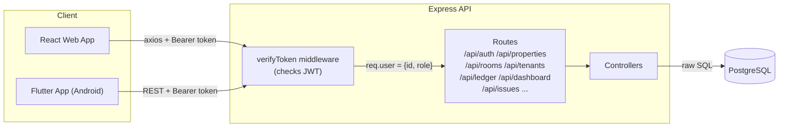
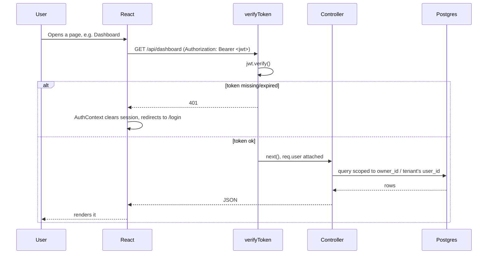
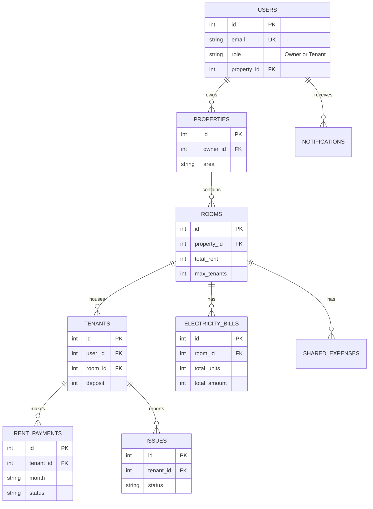
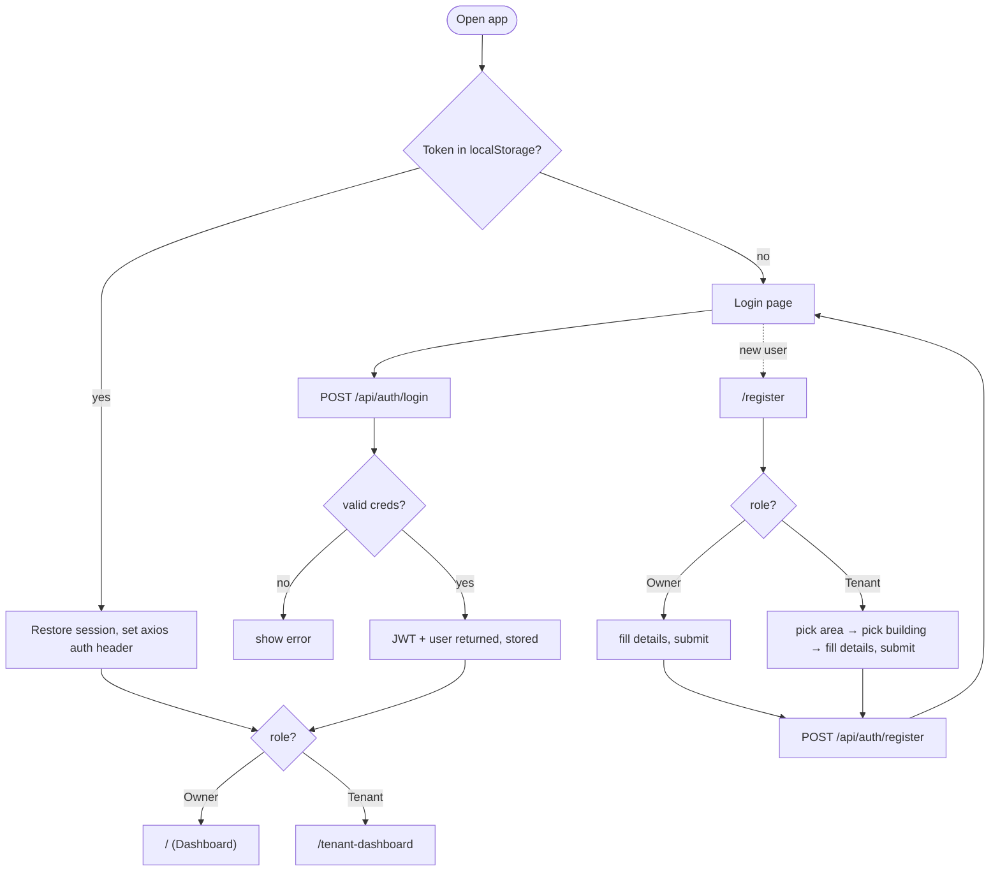

# LeaseMate

Smart tenant management system — basically a digital replacement for the rent notebook every PG/hostel owner keeps. Tracks rooms, tenants, rent, electricity bills, deposits, and maintenance complaints in one place instead of three different WhatsApp chats and a diary.

Built as a full-stack app (React + Express + PostgreSQL), with a Flutter Android client in progress alongside it.

## Why this exists

Most small property owners (PGs, shared flats, hostels) manage everything manually — a physical ledger for rent, a separate notebook for electricity units, and phone calls for complaints. LeaseMate puts all of that behind a login: owners get a dashboard, tenants get their own dashboard, and the math (rent splitting, electricity splitting, dues) happens automatically instead of on a calculator.

## Who uses it

There are two roles, both living in the same `users` table:

- **Owner** — adds properties, creates rooms, assigns tenants, generates the monthly rent ledger, tracks who's paid, logs electricity readings, and handles maintenance issues.
- **Tenant** — logs in and just sees *their* stuff: what they owe this month, their electricity share, shared expenses with roommates, and a place to report issues.

The JWT you get on login carries your role, and everything downstream — routes, dashboards, what buttons even show up — is gated on that.

## What it actually does

**Owner side:**
- Add/manage properties (grouped by area so it doesn't turn into a giant dropdown)
- Rooms with rent amount + max occupancy
- Assign registered tenants into rooms, track their deposit
- Auto-generate the monthly rent ledger (splits rent + electricity across roommates)
- Mark payments as received
- Log electricity meter readings, bill gets calculated from units × rate
- View and resolve tenant-reported issues
- Dashboard with rent/payment analytics

**Tenant side:**
- Personal dashboard — current dues, rent breakdown, electricity usage over time
- Splitwise-style shared expense tracking with roommates
- Report and follow up on maintenance issues
- Rent-due notifications

**Shared living stuff** (this is the part that made it worth building instead of just using a spreadsheet):
- A room can have multiple tenants
- Rent and electricity bills split evenly across whoever's in the room
- Shared expenses (groceries, wifi, whatever) logged per room, visible to everyone in it

## Stack

- **Backend:** Node.js + Express 5
- **DB:** PostgreSQL (raw SQL via `pg`, no ORM)
- **Frontend:** React 19 + Vite, Tailwind, Chart.js for the graphs
- **Mobile:** Flutter (Android)
- **Auth:** JWT + bcrypt, nothing fancy
- **Docker:** compose file to run db + backend + frontend together

## How the pieces talk to each other

It's a pretty standard 3-tier setup — React app calls the Express API, Express is the only thing that touches Postgres.



Every private route goes through `verifyToken` before it even reaches its controller. No token, or a bad/expired one, and you get a 401/403 back — the frontend catches that globally and kicks you to `/login`.



## Folder layout

```
LeaseMate/
├── backend/
│   ├── controllers/       # actual business logic, one file per resource
│   ├── routes/             # thin — just wires up controller functions
│   ├── middleware/
│   │   └── authMiddleware.js   # verifyToken
│   ├── db.js               # pg Pool connection
│   ├── database.sql        # schema
│   ├── seed.js              # sample data for testing
│   └── server.js            # entry point, mounts everything
│
├── frontend/
│   └── src/
│       ├── pages/           # one component per screen
│       ├── components/      # Navbar, Sidebar, chart components, cards
│       ├── context/
│       │   ├── AuthContext.jsx      # session state, axios auth header
│       │   └── ProtectedRoute.jsx   # role-based route guard
│       ├── layout/MainLayout.jsx
│       ├── services/api.js
│       └── App.jsx           # routes
│
├── android/                 # Flutter client
├── docker-compose.yml
└── Dockerfile
```

## Database

Nothing exotic — nine tables, mostly foreign-keyed off `users` → `properties` → `rooms` → `tenants`.



## Login / register — how it actually flows

Registration has a small twist: if you're signing up as a Tenant, you don't just get a free-text address field — you pick an **area** first (this hits `GET /api/auth/areas`), and only then does the building dropdown populate (`GET /api/auth/properties?area=...`). Doing it this way stops the dropdown from becoming a 200-item list of every PG in the city. Owners skip this — they add their own properties after logging in.



On the frontend, `ProtectedRoute` also enforces role — if a Tenant somehow tries to hit `/properties`, they get bounced to `/tenant-dashboard` instead of seeing a broken page.

## Walking through a typical owner's day

1. Add the property (with its area).
2. Add rooms under it — set the rent and how many people can share.
3. Check `unassigned tenants` (people who registered under this property but aren't placed in a room yet) and assign them, entering their deposit.
4. At the start of the month, hit "generate ledger" — this splits each room's rent + electricity bill across its tenants and creates a `rent_payments` row for each of them.
5. As people pay, mark their entry paid.
6. Log electricity meter readings when the bill comes in — units × rate gets calculated automatically, and that number feeds into next month's ledger.
7. Check the issues list occasionally and update statuses as things get fixed.

And on the tenant side, it's much simpler: log in, see what you owe and your electricity trend, log a complaint if something's broken, check who owes what in the shared expenses.

## API endpoints

Quick reference — everything except register/login/areas/properties needs `Authorization: Bearer <token>`.

```
POST   /api/auth/register
POST   /api/auth/login
GET    /api/auth/areas
GET    /api/auth/properties          ?area= / ?q=

GET    /api/properties  POST /add  DELETE /:id
GET    /api/rooms       POST /add  DELETE /:id
GET    /api/tenants     POST /add  DELETE /:id

POST   /api/ledger/add
POST   /api/ledger/generate
GET    /api/ledger
PUT    /api/ledger/paid/:id

GET    /api/dashboard
GET    /api/dashboard/rent-analytics
GET    /api/dashboard/payment-analytics

GET    /api/tenant-dashboard
GET    /api/tenant-dashboard/expense-analytics

GET    /api/users/me
GET    /api/users/tenants/unassigned

GET    /api/notifications/rent-due
PUT    /api/notifications/mark-read/:id
POST   /api/notifications/clear-all

POST   /api/issues/report
GET    /api/issues
PUT    /api/issues/:id
```

## Running it locally

**Backend**
```bash
cd backend
npm install
psql -U postgres -d leasemate_db -f database.sql
node server.js
```
Runs on `localhost:5000`. There's also `seed.js` if you want sample owner/tenant accounts to poke around with instead of registering fresh.

**Frontend**
```bash
cd frontend
npm install
npm run dev
```
Vite dev server, default `localhost:5173`.

**Or just Docker Compose everything:**
```bash
docker compose up --build
```
That spins up Postgres, the backend, and the frontend together. Frontend ends up on `localhost:8090`, backend/db stay internal to the compose network.

DB connection settings (`backend/db.js`) fall back to local defaults if you don't set env vars — `PGUSER`, `PGHOST`, `PGDATABASE`, `PGPASSWORD`, `PGPORT`.

## Rough edges / TODO

- JWT secret is hardcoded in `authController.js` / `authMiddleware.js` right now instead of pulled from an env var — fine for local dev, needs fixing before this goes anywhere public.
- No `.env.example` yet.
- No license file — add one if you want other people using this.
- No automated tests currently.

## Contributing

Open an issue first if it's a bigger change, otherwise PRs are welcome.
