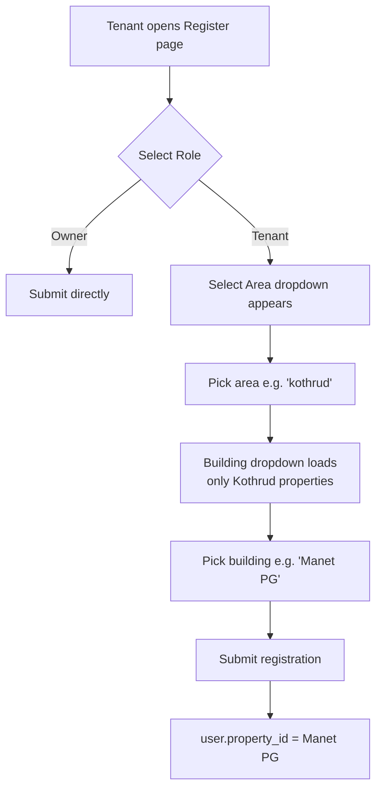

# Walkthrough: Tenant-Property Association + Area Filtering

## Changes Summary

### Feature 1: Tenant-Property Association
Tenants now select a building during registration. Owners only see tenants registered for their properties.

### Feature 2: Area-Based Filtering
Properties have an area field. During registration, tenants first pick an area, then see only buildings in that area.

## Files Modified

| File | Change |
|------|--------|
| [database.sql](file:///d:/projects/LeaseMate/backend/database.sql) | Added `property_id` to `users`, `area` to `properties` |
| [authController.js](file:///d:/projects/LeaseMate/backend/controllers/authController.js) | Added [getDistinctAreas](file:///d:/projects/LeaseMate/backend/controllers/authController.js#7-19), updated [getPublicProperties](file:///d:/projects/LeaseMate/backend/controllers/authController.js#20-42) (area filter), updated [register](file:///d:/projects/LeaseMate/backend/controllers/authController.js#43-76) |
| [authRoutes.js](file:///d:/projects/LeaseMate/backend/routes/authRoutes.js) | Added `/areas` and `/properties` public routes |
| [userController.js](file:///d:/projects/LeaseMate/backend/controllers/userController.js) | Filtered unassigned tenants by owner's properties |
| [propertyController.js](file:///d:/projects/LeaseMate/backend/controllers/propertyController.js) | [addProperty](file:///d:/projects/LeaseMate/backend/controllers/propertyController.js#3-25) accepts area, stores lowercase |
| [Properties.jsx](file:///d:/projects/LeaseMate/frontend/src/pages/Properties.jsx) | Added area input + area column in table |
| [Register.jsx](file:///d:/projects/LeaseMate/frontend/src/pages/Register.jsx) | Two-step flow: Select Area → Select Building |
| [Tenants.jsx](file:///d:/projects/LeaseMate/frontend/src/pages/Tenants.jsx) | Shows property name in user dropdown |

## Registration Flow



## Case-Insensitive Handling
Areas are stored **lowercase** using `LOWER()` on insert. Any input like "Loni Kalbhor", "LONI KALBHOR", or "LoNi KaLbHoR" all become `loni kalbhor` in the database.

## ⚠️ Required: Run These Migrations

```sql
ALTER TABLE users ADD COLUMN property_id INT REFERENCES properties(id);
ALTER TABLE properties ADD COLUMN area VARCHAR(100);
```
